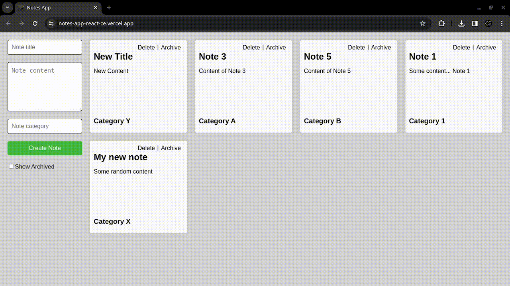

# Notes web application



 Single Page Web Application (SPA) for Note creation and management.

## Live Demo

Take a look at the __live demo__: 
 
 https://notes-app-react-ce.vercel.app/

* Check the live API URL:

https://notes-app-node-ce.vercel.app/api/notes

## Local environment

### Prerequisites
- [Docker](https://docs.docker.com/engine/install/) and [Docker-compose](https://docs.docker.com/compose/install/) installed.

## Execute run.sh

To execute the project in a local environment, simply execute the script `run.sh`.

It will take some minutes to install all dependencies and create the docker instances.

```sh
./run.sh
```

Output:

```sh
cristian@localhost:~/Projects/Encalada-b942dc$ ./run.sh 
Creating network "encalada-b942dc_default" with the default driver
Building frontend
[+] Building 2.7s (10/10) FINISHED                                                                               docker:default
 => [internal] load build definition from Dockerfile                                                                       0.0s
 => => transferring dockerfile: 450B                                                                                       0.0s
 => [internal] load .dockerignore                                                                                          0.0s
 => => transferring context: 2B                                                                                            0.0s
 => [internal] load metadata for docker.io/library/node:18-alpine                                                          0.8s
 => [internal] load build context                                                                                          1.8s
 => => transferring context: 3.33MB                                                                                        1.7s
 => [1/5] FROM docker.io/library/node:18-alpine@sha256:b1a0356f7d6b86c958a06949d3db3f7fb27f95f627aa6157cb98bc65c801efa2    0.0s
 ...
 ...
 ...
  => CACHED [builder 6/6] RUN npx prisma generate                                                                           0.0s
 => CACHED [stage-1 3/3] COPY --from=builder /usr/src/app .                                                                0.0s
 => exporting to image                                                                                                     0.0s
 => => exporting layers                                                                                                    0.0s
 => => writing image sha256:fe3d0ed44c6a41207ef2fde65a6733f50b29af90909dfaf062a64dc1513586c6                               0.0s
 => => naming to docker.io/library/encalada-b942dc_backend                                                                 0.0s
Creating encalada-b942dc_mysql_1    ... done
Creating encalada-b942dc_frontend_1 ... done
Creating encalada-b942dc_backend_1  ... done
The MySQL database is now running on port 3306
The React app (frontend) is now running on http://localhost:3000
The Express app (backend) is now running on http://localhost:5000
```

## Features

### Create, edit and delete notes


### Archive/unarchive notes


### List active notes

### List archived notes

## Technologies

### Front-end

* __Framework: `React`__

React.js is a popular choice for building SPAs, providing a component-based architecture and efficient rendering.

* __Frontend dependencies__

```json
    "react": "^18.2.0",
    "react-dom": "^18.2.0",
    "react-scripts": "5.0.1",
    "typescript": "^4.9.5",
```
For more details check [frontend/package.json](./frontend/package.json)

### Backend

* __Framework: `Express.js (Node.js)`__

Express.js is a flexible Node.js framework that allows for easy creation of RESTful APIs.

```json
    "nodemon": "^3.0.2",
    "ts-node": "^10.9.2",
    "typescript": "^5.3.3"
    "@prisma/client": "^5.7.1",
    "cors": "^2.8.5",
    "dotenv": "^16.3.1",
    "express": "^4.18.2",
    "prisma": "^5.7.1"
```
### Database

* __Relational Database Management System (RDBMS): `MySQL`__

MySQL is a popular open-source relational database management system. 

* __ORM: `Prisma` for MySQL__

Prisma is an open-source ORM focused on making it easy for Node. js and TypeScript applications to work with databases.

### Programming Language

* __Typescript__

TypeScript is a free and open-source high-level programming language developed by Microsoft that adds static typing with optional type annotations to JavaScript.

## Backend Architecture

The back-end side uses a [Service Layer](https://martinfowler.com/eaaCatalog/serviceLayer.html) pattern.

### Directory structure

* [controllers](./backend/src/controllers/): Handles the HTTP request/response logic.
* [models](./backend/src/models/): Data models definitions.
* [repositories](./backend/src/controllers/): Manages data access logic using Prisma.
* [services](./backend/src/services/): ontains business logic. The services communicate with repositories for data access.
* [index.ts](./backend/src/index.ts): Entry point to initialize Express and define route handlers.

### Bugs

#### Frontend

- In this initial version, there is a bug unarchiving the notes from the UI, it might be related with the `handleUpdateNote` function or the `useEffect` Hook. I have to do a further debugging to fix it. (Through the backend API, the archive/unarchive update is working as expected)

### Author

[Cristian Encalada](https://github.com/cristian-encalada) - _Software developer_
